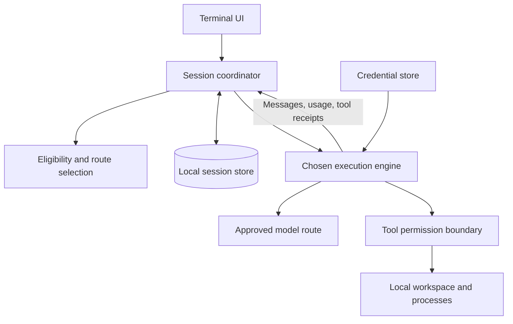
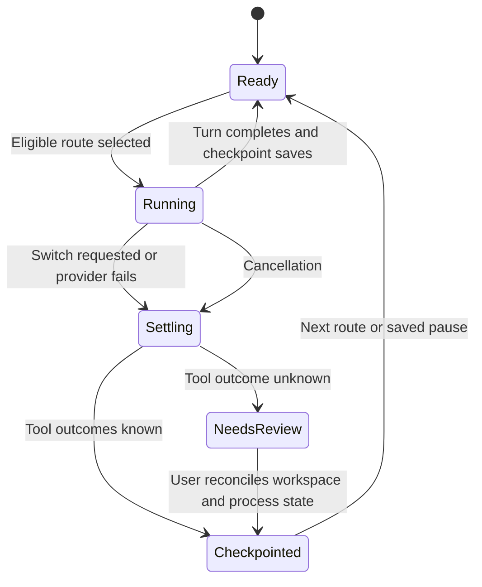

# Architecture

**Status:** the [runtime decision](decisions/0001-direct-runtime.md) selects a direct TypeScript request loop. A first OpenRouter slice is implemented. This document also describes the broader target architecture; unimplemented provider policies, context compaction, and richer UI remain in the [delivery plan](PLAN.md).

## System shape

One local application owns the user experience, routing policy, and durable task state. A single chosen execution engine runs the coding loop. No Robinhood cloud account or hosted service is required.

These are code boundaries, not separate microservices. The application executes its own small request/tool loop; OpenCode is used only by the isolated feasibility experiment.

## Runtime decision

**Resolved:** use the direct API runtime. The OpenCode experiment passed permission, manual handoff, tool-receipt, and restart checks, but also observed engine-level retries beyond the provider's `maxRetries: 0` setting. Keeping a synchronous policy gate and a single durable execution journal is simpler for this product. See [decision 0001](decisions/0001-direct-runtime.md) for results and limitations.

The original evaluation criteria below explain how that decision was made; they are not a second runtime under development.

**Preferred experiment:** a thin Robinhood coordinator around a pinned OpenCode server and its supported TypeScript SDK. The SDK documents session messages, per-prompt model selection, permissions, cancellation, and event subscriptions. That makes reuse worth testing; it does not establish the recovery guarantees this product needs. [OpenCode SDK](https://opencode.ai/docs/sdk/), [server interface](https://opencode.ai/docs/server/).

Timebox the experiment inside M1. It must prove:

1. The coordinator observes every model request or constrains all engine requests to the approved route and budget. Helper models, automatic retries, and internal compaction cannot bypass policy.
2. Tool permission requests arrive before execution. Tool start and completion can be durably correlated with the task.
3. Cancellation and provider failure leave a discoverable execution state. Reconnect does not replay a completed tool.
4. A saved session can switch providers and reconstruct valid context through public APIs. Incompatible tool formats and context limits are handled explicitly.
5. Credential persistence and all engine-owned storage are understood. Disconnect, export, and deletion have complete behavior.
6. Repository config, plugins, and subprocesses cannot silently expand the chosen permissions or model routes.
7. Installation, process cleanup, and paths with spaces work on native Windows.

**Decision rule:** reuse OpenCode only if the mandatory controls are enforceable through supported interfaces and bounded configuration. Otherwise use a small direct provider loop with established SDKs. Choose once, document measurements, and remove the discarded experiment from the shipping path. Do not build a runtime plugin framework or maintain two engines in v0.1.

OpenCode documents API-key storage in a local `auth.json` file. An OS vault in Robinhood alone would not protect a second plaintext copy written by the engine. M1 must prove a supported session-only injection or equally explicit storage strategy before claiming secure credential persistence. [OpenCode provider credentials](https://opencode.ai/docs/providers/).

## Initial stack

| Area | Starting choice | Reason / gate |
| --- | --- | --- |
| Application | TypeScript, Node.js 24 LTS | One language for coordinator, adapters, tests, and UI; validate supported engine requirements in M1 |
| Terminal | Node readline for the first slice; Ink deferred | Streaming interactive commands now; richer terminal rendering follows workflow validation |
| Local persistence | SQLite with a small typed data-access layer | Transactions for checkpoints and receipts; no database server |
| SQLite binding | Pinned `better-sqlite3` | Windows installed and tested locally; CI checks the remaining OS matrix |
| Credentials | Process-only prompt or environment variable | No persisted key copies; OS-vault integration is deferred |
| Tests | Small unit tests plus provider fixtures and process-level scenarios | Reproduce failures without remote accounts |
| Distribution | One npm package and CLI entry point initially | Check naming and clean installation before publishing |

Technology references checked for this plan: [Node release schedule](https://nodejs.org/en/about/previous-releases), [Ink](https://github.com/vadimdemedes/ink), [better-sqlite3](https://github.com/WiseLibs/better-sqlite3). Pin concrete dependency versions when M1 starts; do not copy today's version numbers into a permanent architecture promise.

## Data ownership and shared memory

Robinhood's local store is authoritative for task identity, explicit user constraints, project policy, normalized visible conversation, tool receipts, and checkpoints. Keep an append-only sequence of relevant events plus small current-state tables. This is a local execution journal, not a distributed event platform.

The selected runtime has no second engine transcript. It stores normalized messages and tool-call IDs directly in Robinhood's database. Any future official-agent integration must define its separate thread ownership and import/export behavior before joining this model. Exclude credentials and internal reasoning from portable memory.

Minimal stored concepts:

- **Session:** workspace identity, objective, selected route, status, and timestamps.
- **Events:** user/assistant messages, route changes, permission decisions, and tool lifecycle records.
- **Checkpoint:** last settled event sequence, pinned facts, recent context references, and workspace state.
- **Usage observations:** provider/account scope, units, observed consumption, reset/cooldown, and evidence source.
- **Connection metadata:** provider identity and credential reference; never the secret itself.

A context packet contains the objective, user constraints, concise decisions, relevant file paths/hashes, recent messages, completed tool receipts, and the next unresolved step. Preserve exact source records locally. A generated summary references those records and is editable; it cannot rewrite explicit user constraints.

Use deterministic trimming and task facts before adding model-generated summaries. If a summary needs a model call, route it through the same eligibility gate and record its usage. Reserve space for tools and output; tokenizer estimates are conservative and labeled. Never assume two providers count tokens identically.

The current preview retains the visible conversation and objective and rejects requests beyond a conservative context budget; automatic compaction and editable pinned memory are pending. No vector database or embeddings in v0.1. Add SQLite text search only when simple recent-context selection becomes insufficient. Future cross-session project memory must be explicit and editable; do not silently mix unrelated repositories.

## Routing and allowances

One deterministic decision path runs before every model request:

1. Filter to connected providers allowed for this project.
2. Match required capabilities and context capacity.
3. Validate the route's current free-access eligibility and account scope.
4. Exclude known exhausted routes and active cooldowns.
5. Apply the user's stable provider priority and select the first eligible route.
6. Record why the route was selected, then submit a bounded request.

Selection is ordinary code, not an LLM decision. Models cannot authorize a provider, a paid route, or a tool permission.

Track request and token limits separately. Each observation includes its provider/account/project/model scope, shared quota group if known, time window, reset semantics, source, and confidence. Local usage is only the traffic Robinhood observed; other apps may consume the same pool. Do not label local subtraction as an authoritative account balance.

Classify failures into authentication, quota, transient capacity, context/capability, tool, and local persistence errors. Authentication needs reconnect; context errors need a smaller packet or another capable model. Quota/capacity can trigger bounded retry or handoff after execution settles. Honor provider retry hints and avoid repeatedly testing exhausted routes.

The [provider policy](PROVIDERS.md#free-access-policy) defines eligibility. If evidence becomes insufficient, disable automatic use of that route and explain what is missing. Provider-side spending controls are part of setup where available; application estimates cannot guarantee billing behavior outside its control.

## Handoff and crash recovery

Each tool operation has an ID and a durable state: `prepared`, `running`, `completed`, `failed`, or `unknown`. Save intent and permission before launching a side effect; save its completion receipt before allowing the next dependent step. Checkpoint the settled sequence transactionally.

When the provider changes, stop admitting new tool operations, settle or cancel active work, save the checkpoint, build the context packet, and start the next route. Keep partial assistant output marked incomplete. A switch is a continuation from verified state, not blind resubmission of the last request.

A shell process can complete between the external side effect and the local receipt write. There is no general exactly-once guarantee for arbitrary commands. If the process outcome cannot be established after a crash, mark it unknown and pause for reconciliation. An operation ID helps deduplicate known records; it does not make an external service idempotent.

On resume, compare workspace identity, branch/HEAD where applicable, dirty diff, and relevant file hashes. Re-read changed files and refuse a stale patch. Never reset user changes as a recovery shortcut.

## Tools, credentials, and local boundaries

- Centralize read/search/write/exec permissions. Resolve real paths, symlinks, and Windows junctions at the boundary; a string prefix check is insufficient.
- Show the exact command and working directory before approval. Scope remembered approval narrowly, and treat a changed command as a new action.
- Apply timeout, cancellation, process-tree cleanup, and output-size limits. Bound file reads and patches as well as shell output.
- Permission checks are not an operating-system sandbox. Approved commands run with the user's OS privileges; communicate that accurately.
- Treat repository files, tool output, and model text as data that cannot grant new permissions. Require explicit trust before loading executable project hooks or external plugins.
- Bind a reused server to loopback with a per-launch secret where supported; do not expose it to the network by default.
- Store credentials outside the repository and prompt context. Prefer an OS vault; when unavailable, offer session-only access with a clear explanation. Avoid command-line secrets and redact known credentials from logs and exports.
- Keep session data under the OS application-data directory with restrictive permissions. Session content can contain source code; do not claim at-rest encryption unless implemented and verified.
- Account disconnect removes stored credentials. Session deletion handles Robinhood and engine-owned records; explain backup/export copies that deletion cannot reach.

## Keep the codebase small

After the engine decision, begin with one package containing `cli`, `session`, `routing`, `storage`, and `providers` modules. Add a `tools` module only for execution logic the chosen engine does not safely supply. Separate tests by behavior, not by a large framework taxonomy.

Start with explicit functions and typed records. An adapter interface should emerge from the launch providers' shared needs: describe capabilities, submit/cancel a turn, normalize events, and report usage or its absence. Do not invent interfaces for future media services or autonomous agents before integrating one.
